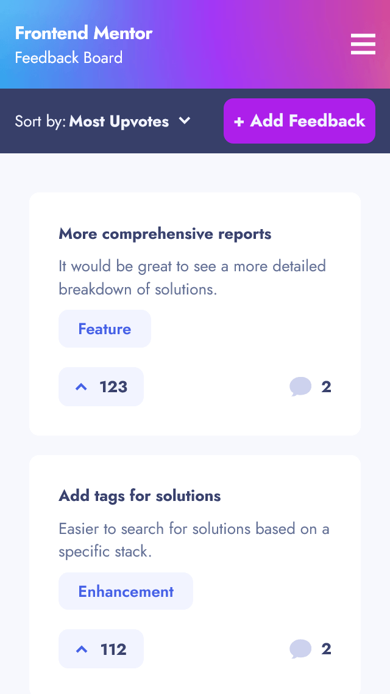
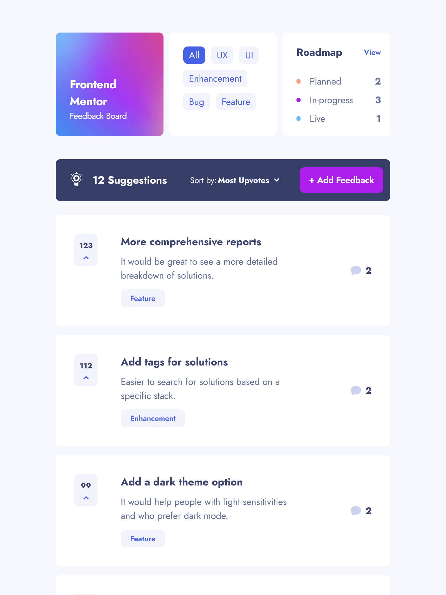
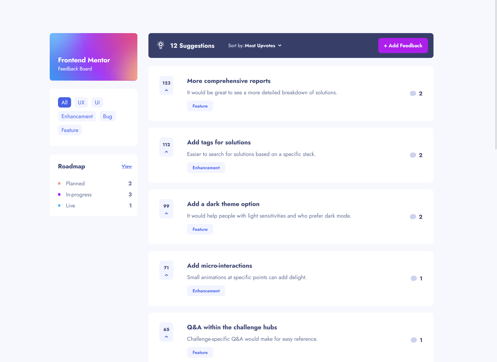

# Links

-  [Click here to check solution URL](https://github.com/JoannaLapa/product-feedback-app)
-  [Click here to see Live Site URL](https://product-feedback-app-jl.netlify.app/)

# Frontend Mentor - Product feedback app solution

It is a solution to the [Product feedback app challenge on Frontend Mentor, level guru](https://www.frontendmentor.io/challenges/product-feedback-app-wbvUYqjR6). 

## Table of contents

- [Overview](#overview)
  - [The challenge](#the-challenge)
  - [Screenshot](#screenshot)
  - [Links](#links)
- [My process](#my-process)
  - [Built with](#built-with)
  - [What I learned](#what-i-learned)
  - [Continued development](#continued-development)
  - [Useful resources](#useful-resources)
- [Author](#author)
- [Acknowledgments](#acknowledgments)

## Overview

### The challenge

Users should be able to:

- Sort suggestions by most/least upvotes and most/least comments
- Filter suggestions by category
- View the optimal layout for the app depending on their device's screen size
- See hover states for all interactive elements on the page
- Upvote product feedback requests
- Create, read, update, and delete product feedback requests
- Receive form validations when trying to create/edit feedback requests
- Add comments and replies to a product feedback request
- Keep track of any changes, even after refreshing the browser (with usage of `localStorage`)

### Screenshots

## My process

### Built with

- [Vue.js](https://vuejs.org/) - JS framework
- [Vite.js](https://vitejs.dev/) - build tool
- [Pinia](https://pinia.vuejs.org/) - Vue.js Store
- [Tailwind CSS](https://tailwindcss.com/) - CSS framework
- [Headless UI](https://headlessui.com/) 
- [Vuelidate](https://vuelidate-next.netlify.app/)
- Semantic HTML5 markup
- Flexbox
- CSS Grid
- Mobile-first workflow

### What I learned

I learnt Vue.js basic concepts, Pinia basics, Tailwind CSS, validation forms with Vuelidate library. I've also learnt how to created reusable components with Vue 3.

### Continued development

At this moment I focus on learning Vue.js and I continue to deepen my knowledge of JavaScript. I am going to learn about testing the application and Typescript.

### Useful resources

- [Vue.js documentation](https://vuejs.org/guide/introduction.html) 
- [Pinia documentation](https://pinia.vuejs.org/) 
- [Tailwind CSS documentation](https://tailwindcss.com/)

## Author

- Frontend Mentor - [@JoannaLapa](https://www.frontendmentor.io/profile/JoannaLapa)
- LinkedIn - [Joanna Łapa](https://www.linkedin.com/in/joanna-lapa-/)

## Acknowledgments

I would like to thank Aleksandra Kręcisz - my mentor during Dare IT mentoring programm for her feedbacks, lots of useful advices concering Vue good practices, performance issues and huge commitment.

